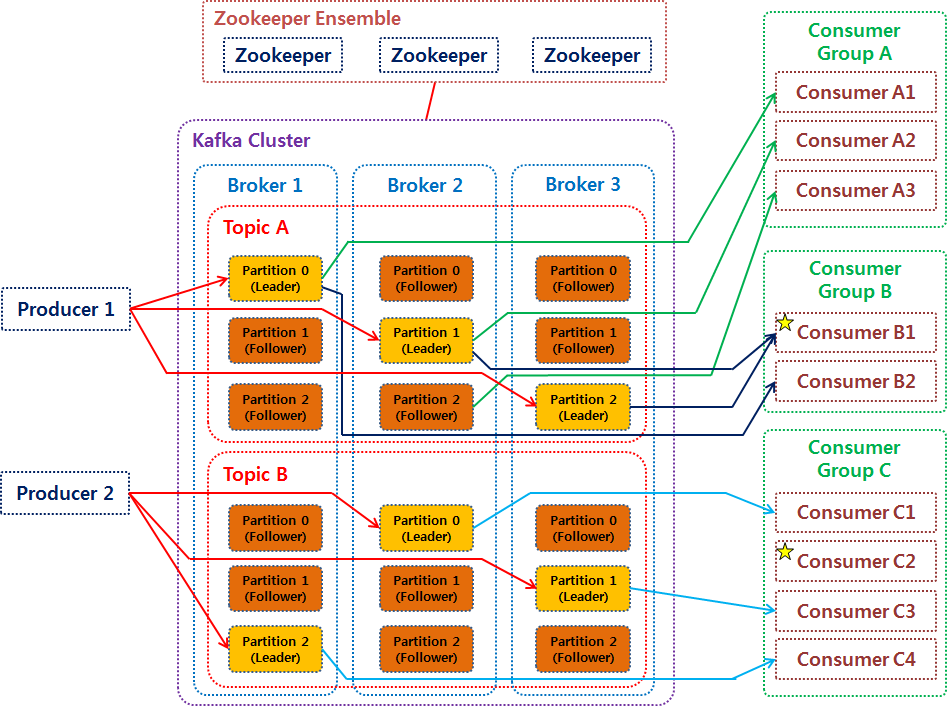
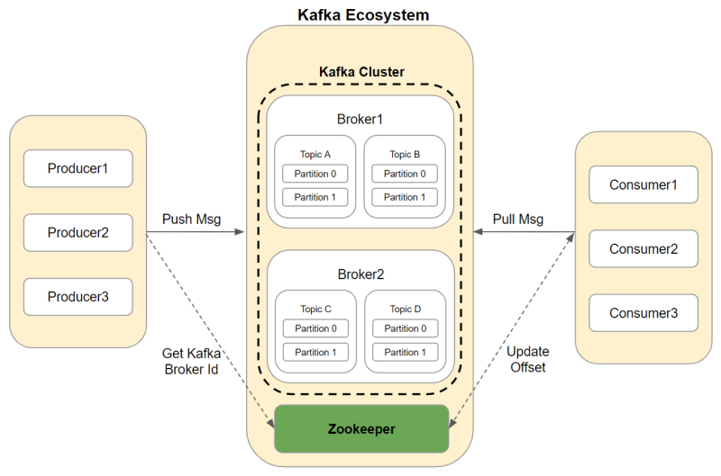
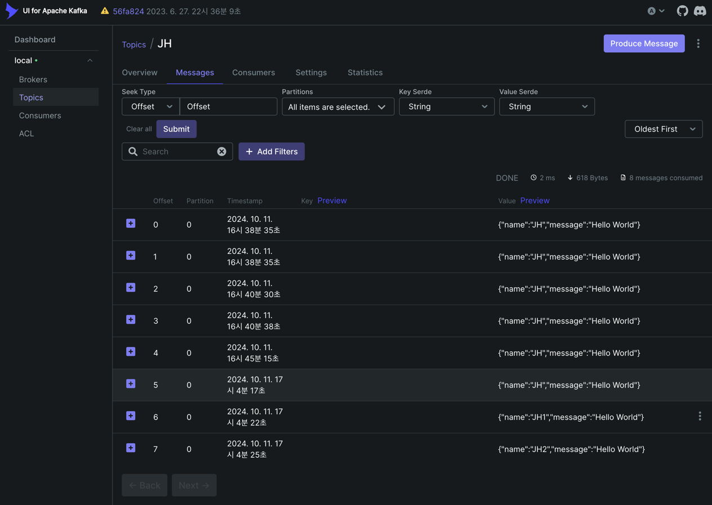

## Kafka 학습

### Kafka 구성 요소

https://velog.io/@jwpark06/Kafka-%EC%8B%9C%EC%8A%A4%ED%85%9C-%EA%B5%AC%EC%A1%B0-%EC%95%8C%EC%95%84%EB%B3%B4%EA%B8%B0

https://blog.naver.com/data_flow/222632955951

- `주키퍼(Zookeeper)`
    - 아파치 프로젝트 애플리케이션으로, 카프카의 메타데이터 관리 및 브로커의 정상 상태 점검(Health Check) 등을 담당
- `카프카(카프카 클러스터)`
    - 여러 대의 브로커를 구성한 클러스터
- `브로커(Broker)`
    - 카프카 애플리케이션이 설치된 서버 또는 노드
    - 브로커 서버 1대로도 기본 기능이 실행되미잔, 데이터를 안전하게 보관하고 처리하기 위해 3대 이상의 브로커 서버를 1개의 클러스터로 묶어서 운영한다.
    - 프로듀서로부터 전달된 데이터는 파일 시스템에 저장된다.
- `토픽(Topic)`
    - 카프카에서 데이터를 구분하기 위해 사용하는 단위
    - 토픽은 1개 이상의 파티션을 소유
    - 파티션에는 프로듀서가 보낸 데이터들이 저장되는데, 이 데이터를 ‘레코드’라고 함
    - 카프카는 메시지 피드들을 토픽으로 구분하고, 각 토픽의 이름은 고유값 (DB 테이블)
    - 토픽의 네이밍은 굉장히 중요하다, 네이밍 잘 짓자.
    - ex)
      - prd.marketing-team.sms-platform.json
      - commerce.payment.prod.notification
- `파티션(Partition)`
    - 병렬 처리 및 고성능을 얻기 위해 하나의 토픽을 여러 개로 나눈 것
    - 하나의 토픽에 인입되는 메시지를 분할하여 개별 파티션에 나누어 처리하도록 하여 처리량 증가
    - 한 번 늘리면 파티션을 다시 줄일 수 없다(?), 압축 정책은 가능
    - 오프셋(Offset)은 컨슈머 그룹이 가져간 마지막 레코드에 대한 포인트(인덱스)
    - 실무에서는 특별 케이스가 아니라면, 파티션을 다수로 설정하여 병렬 처리를 통해 처리량을 증가시킨다.
      - 토픽 생성 시 파티션 갯수는 (데이터 처리량, 메시지 키 사용 여부, 브로커&컨슈머 영향도) 고려하여 설정
      - 프로듀서 전송 데이터량 < 컨슈머 데이터 처리량 * 파티션 갯수
- `컨트롤러(Controller)`
    - 클러스터의 다수 브로커 중 한 대가 컨트롤러의 역할을 한다.
    - 컨트롤러는 다른 브로커들의 상태를 체크하고 브로커가 클러스터에서 빠지는 경우 해당 브로커에 존재하는 리더 파티션을 재분배한다.
    - 카프카는 컨슈머가 데이터를 가져가더라도 토픽의 데이터는 삭제되지 않는다. 또한 삭제 요청도 불가능
    - 오래된 데이터를 압축하는 정책을 가져갈수도 있음
- `코디네이터(Coordinator)`
    - 클러스터의 다수 브로커 중 한 대는 코디네이터의 역할을 하는데, 컨슈머 그룹의 상태를 체크하고 파티션을 컨슈머와 매칭되도록 분배하는 역할을 한다.
- `프로듀서(Producer)`
    - 카프카로 메시지를 보내는 역할을 하는 클라이언트
    - `Partitioner` 인터페이스를 구현, `PARTITIONER_CLASS_CONFIG` 설정을 통해 특정 Key에 대해 특정 파티션으로 저장을 할 수 있다.
    - 브로커 정상 전송 여부를 확인하는 프로듀서?
      - send() 메서드 -> 동기
      - Callback 인터페이스 구현 -> 비동기 (데이터의 순서가 중요하다면, 동기로 전송 결과를 받자.)
- `컨슈머(Consumer)`
    - 카프카에서 메시지를 꺼내는 역할을 하는 클라이언트
    - 컨슈머 메시지의 처리 순서를 보장하기 위해서는 하나의 파티션을 사용하거나, 여러 파티션을 사용할 경우, 라운드 로빈 방식이 아닌 발행 메시지에 Key 설정을 통해 특정 Key는 동일한 파티션에 할당되도록 강제할 수 있다.

 

### Kafka 상세 개념
#### 토픽과 파티션
- 토픽 생성 시 파티션 갯수는 (데이터 처리량, 메시지 키 사용 여부, 브로커&컨슈머 영향도) 고려하여 설정
- 프로듀서 전송 데이터량 < 컨슈머 데이터 처리량 * 파티션 갯수
- 데이터를 더이상 사용하지 않을 경우, cleanup.policy 옵션을 통해 데이터를 삭제할 수 있음
  - delete(삭제), compact(압축 - 메시지 키별 오래된 데이터 삭제)

#### 프로듀서
- acks 옵션: 프로듀서가 전송한 데이터가 카프카 클러스터에 얼마나 신뢰성 높게 저장할지 지정할 수 있는 옵션
- acks = 0
  - 프로듀서가 리더 파티션으로 데이터를 전송했을 때 리더 파티션으로 데이터가 저장되었는지 확인하지 않는다.
  - 프로듀서는 전송을 하자마자 데이터가 저장되었음을 가정하고 다음 데이터를 전송한다.
  - 데이터가 일부 유실이 발생하더라도 전송 속도가 중요한 경우, 이 옵션을 사용
- acks = 1
  - 프로듀서는 보낸 데이터가 리더 파티션에만 정상적으로 적재되었는지 확인한다. (리더 파티션에 정상 적재되지 않았다면, 재시도할 수 있다.)
- acks = all 또는 acks = -1
  - 프로듀서는 보낸 데이터가 리더 파티션과 팔로워 파티션에 모두 정상적으로 적재되었는지 확인한다.
  - 일부 브로커에 장애가 발생하더라도 프로듀서는 안전하게 데이터를 전송하고 저장할 수 있음을 보장할 수 있다.
- enable.idempotence(멱등성) 옵션을 지원하여 데이터의 중복 적재를 막을 수 있음
- 트랜잭션 프로듀서도 제공

#### 컨슈머
- 멀티 스레드 컨슈머
- 컨슈머 랙(LAG): 토픽의 최신 오프셋, 컨슈머 오프셋간 차이, 컨슈머가 정상 동작하는지 여부를 확인할 수 있기에 필수 모니터링 지표
  - 명령어, metrics(), 외부 모니터링 툴, 카프카 버로우 등을 통해 체크 가능

 

### Kafka 실습 (Producer - Consumer)
- Kafka Config (Producer, Consumer)
- Producer 메시지 발행 -> Consumer 메시지 구독
- kafka-ui

